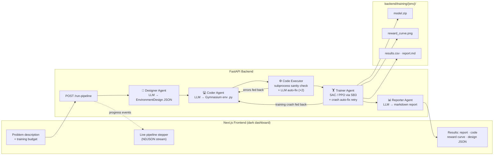
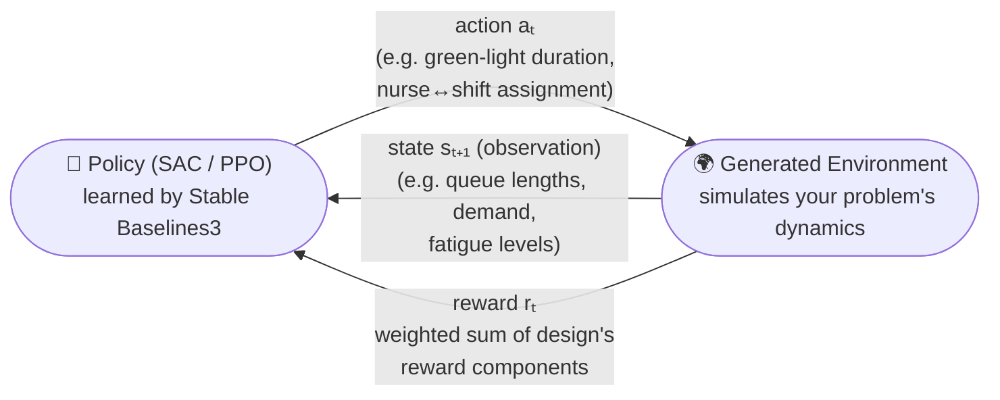

# RL Environment Auto-Designer

Describe a real-world optimization problem in plain English (e.g. *"optimize
hospital shift scheduling"*) and a pipeline of AI agents designs, codes,
debugs, trains, and reports on a reinforcement learning environment for it.

## Pipeline

| # | Agent | Status | What it does |
|---|-------|--------|--------------|
| 1 | **Designer** | ✅ built | Analyzes the problem → structured JSON design (state space, action space, reward function, episode logic, rationale) |
| 2 | **Coder** | ✅ built | JSON design → complete runnable Gymnasium environment (`backend/agents/coder_agent.py`) |
| 3 | **Executor** | ✅ built | Sanity-checks the generated env in a subprocess, auto-fixes failures with the model (`backend/tools/code_executor.py`) |
| 4 | **Trainer** | ✅ built | Trains SAC (Box actions) or PPO via Stable Baselines3, saves model + reward curve + CSV (`backend/agents/trainer_agent.py`) |
| 5 | **Reporter** | ✅ built | Writes a markdown report explaining design decisions and training performance (`backend/agents/reporter_agent.py`) |

## Architecture



### The RL loop inside every generated environment

Each generated Gymnasium environment implements the classic agent–environment
loop. The Designer Agent decides what each arrow carries for your specific
problem:



1. The environment emits a **state** — the observation vector the Designer
   defined (every variable with explicit bounds).
2. The policy picks an **action** — continuous `Box` (→ trained with SAC) or
   `Discrete`/`MultiDiscrete`/`MultiBinary` (→ trained with PPO).
3. The environment simulates one step of your problem's dynamics and returns
   the **reward** — the weighted sum of the design's reward components (each
   one logged per-step in `info["reward_components"]`).
4. Repeat until termination or the design's `episode_length` truncates the
   episode; SB3 optimizes the policy to maximize total reward.

## Tech stack

- **Backend:** FastAPI · Stable Baselines3 · Gymnasium
- **LLM:** Anthropic (`claude-fable-5`) **or** OpenAI (`gpt-5`) — auto-detected
  from whichever API key is in `.env` (see `backend/llm.py`)
- **Frontend:** Next.js · Tailwind · shadcn/ui (scaffold under `frontend/`)

## Project structure

```
rl-env-designer/
├── backend/
│   ├── main.py                 # FastAPI app (all endpoints + NDJSON streaming)
│   ├── llm.py                  # Provider layer (Anthropic / OpenAI)
│   ├── schemas.py              # Pydantic contracts shared by all agents
│   ├── agents/
│   │   ├── designer_agent.py   # Designer Agent (structured output)
│   │   └── coder_agent.py      # Coder Agent (env code generation + auto-fix)
│   │   ├── trainer_agent.py    # SB3 training (SAC/PPO) + reward curves
│   │   └── reporter_agent.py   # Markdown report generation
│   ├── tools/
│   │   └── code_executor.py    # Subprocess sanity check + auto-fix loop
│   ├── generated_envs/         # Gymnasium files written by the Coder Agent
│   └── training/{env_name}/    # model.zip, reward_curve.png, results.csv, report.md
├── frontend/                   # Next.js app (to be scaffolded)
├── requirements.txt
├── .env.example
└── README.md
```

## Getting started

### 1. Backend (FastAPI, port 8000)

```powershell
# Install dependencies (downloads PyTorch — allow a few minutes)
python -m venv .venv
.venv\Scripts\Activate.ps1
pip install -r requirements.txt

# Configure secrets
copy .env.example .env   # then paste your ANTHROPIC_API_KEY

# Run
cd backend
uvicorn main:app --reload
```

### 2. Frontend (Next.js, port 3000)

```powershell
cd frontend
npm install
npm run dev
```

Open http://localhost:3000, describe a problem (or click an example chip),
and hit **Generate Environment**. The page consumes the NDJSON stream from
`POST /run-pipeline` and shows live progress through all 5 stages, then the
report, generated code, reward curve, and design JSON in tabs.

The frontend reads the backend URL from `frontend/.env.local`
(`NEXT_PUBLIC_API_URL=http://localhost:8000`).

### Try the Designer Agent

```powershell
curl.exe -X POST http://127.0.0.1:8000/design `
  -H "Content-Type: application/json" `
  -d '{\"problem_description\": \"optimize hospital shift scheduling\"}'
```

Response shape:

```json
{
  "design": {
    "environment_name": "HospitalShiftEnv",
    "problem_summary": "...",
    "state_space": { "gym_space_type": "Box", "variables": [...] },
    "action_space": { "gym_space_type": "Box", "variables": [...] },
    "reward_function": { "components": [...] },
    "episode_length": 168,
    "termination_conditions": [...],
    "recommended_algorithm": "SAC",
    "design_rationale": "..."
  },
  "model": "claude-fable-5",
  "usage": { "input_tokens": 0, "output_tokens": 0 }
}
```

### Generate + verify the environment code

```powershell
# Step 2: pass the "design" object from /design to /code
curl.exe -X POST http://127.0.0.1:8000/code `
  -H "Content-Type: application/json" `
  -d "@design.json"        # -> {"file_path": "...\\hospital_shift_env.py", "code": "..."}

# Step 3: sanity-check it (reset + 3 random steps; auto-fixes up to 2x on failure)
curl.exe -X POST http://127.0.0.1:8000/execute `
  -H "Content-Type: application/json" `
  -d '{\"file_path\": \"hospital_shift_env.py\"}'
# -> {"success": true, "error": null, "output": "...", "fix_attempts": 0, ...}
```

### Run the whole pipeline at once

`POST /run-pipeline` runs all 5 stages and streams NDJSON progress events:

```powershell
curl.exe -N -X POST http://127.0.0.1:8000/run-pipeline `
  -H "Content-Type: application/json" `
  -d '{\"problem_description\": \"optimize hospital shift scheduling\", \"n_timesteps\": 50000}'
```

```jsonl
{"stage": "designing", "status": "in_progress", "message": "Analyzing the problem..."}
{"stage": "designing", "status": "complete", "data": { ...EnvironmentDesign... }}
{"stage": "coding",    "status": "complete", "data": {"file_path": "...", "code": "..."}}
{"stage": "executing", "status": "complete", "data": {"output": "...", "fix_attempts": 0}}
{"stage": "training",  "status": "complete", "data": { ...TrainingResult... }}
{"stage": "reporting", "status": "complete", "data": {"report_md": "...", "report_path": "..."}}
{"stage": "pipeline",  "status": "complete", "message": "All 5 stages finished."}
```

Individual stages are also available: `POST /train` (`{file_path, design, n_timesteps}`)
and `POST /report` (`{design, training_result}`).

Interactive API docs: http://127.0.0.1:8000/docs
